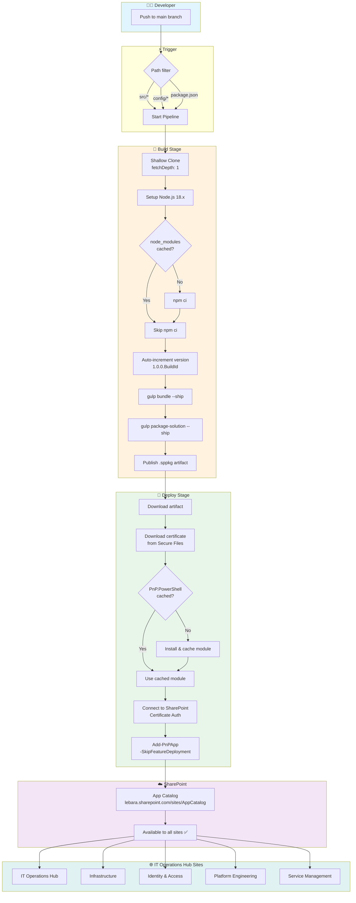

```mermaid
flowchart TB
    subgraph Developer["👨‍💻 Developer"]
        A[Push to main branch]
    end

    subgraph Trigger["⚡ Trigger"]
        B{Path filter}
        B -->|src/*| C[Start Pipeline]
        B -->|config/*| C
        B -->|package.json| C
    end

    subgraph Build["🔨 Build Stage"]
        C --> D[Shallow Clone<br/>fetchDepth: 1]
        D --> E[Setup Node.js 18.x]
        E --> F{node_modules<br/>cached?}
        F -->|Yes| H[Skip npm ci]
        F -->|No| G[npm ci]
        G --> H
        H --> I[Auto-increment version<br/>1.0.0.BuildId]
        I --> J[gulp bundle --ship]
        J --> K[gulp package-solution --ship]
        K --> L[Publish .sppkg artifact]
    end

    subgraph Deploy["🚀 Deploy Stage"]
        L --> M[Download artifact]
        M --> N[Download certificate<br/>from Secure Files]
        N --> O{PnP.PowerShell<br/>cached?}
        O -->|Yes| Q[Use cached module]
        O -->|No| P[Install & cache module]
        P --> Q
        Q --> R[Connect to SharePoint<br/>Certificate Auth]
        R --> S[Add-PnPApp<br/>-SkipFeatureDeployment]
    end

    subgraph SharePoint["☁️ SharePoint"]
        S --> T[App Catalog<br/>lebara.sharepoint.com/sites/AppCatalog]
        T --> U[Available to all sites ✅]
    end

    subgraph Sites["🌐 IT Operations Hub Sites"]
        U --> V[IT Operations Hub]
        U --> W[Infrastructure]
        U --> X[Identity & Access]
        U --> Y[Platform Engineering]
        U --> Z[Service Management]
    end

    A --> B

    style Developer fill:#e1f5fe
    style Build fill:#fff3e0
    style Deploy fill:#e8f5e9
    style SharePoint fill:#f3e5f5
    style Sites fill:#e0f2f1
```
